## 前置准备文档
https://www.yuque.com/lishutong-docs/lines200/bwqcvq
## 启动流程

8086的启动流程，但是为了兼容现代cpu 也是这样的
## 启动扇区
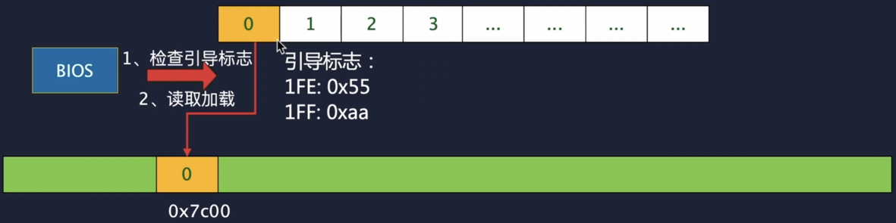
会依次检查所有磁盘的 0 扇区是否为引导扇区
## 开发流程
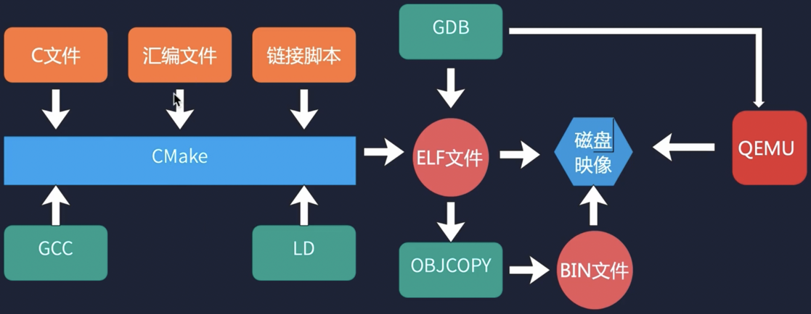
## 段:偏移的访问方式
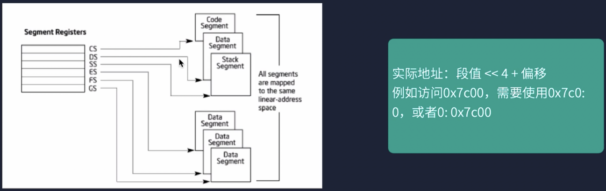
因为CPU地址线只有20位，为了实现32位需要段寄存器，除此之外段寄存器还有其他作用
## 实模式内存映射

实模式下只能访问1m以内的内存，只有灰色区域可以自由使用(Boot程序与Boot栈区也在灰色区域)
## 实模式
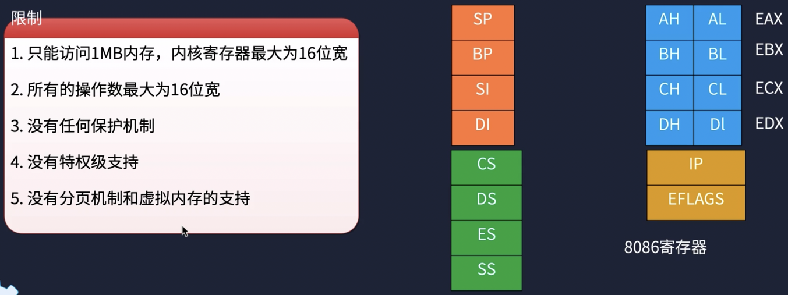
## 保护模式
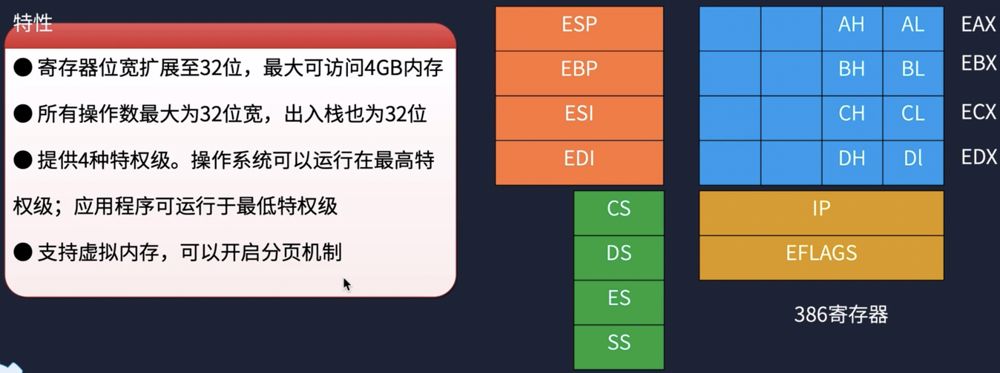
## 保护模式切换流程

## elf数据存储
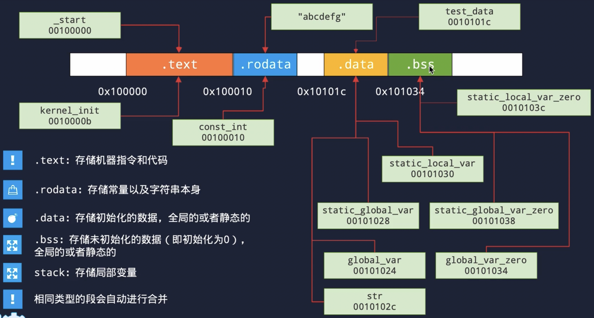
## 内存分段分页
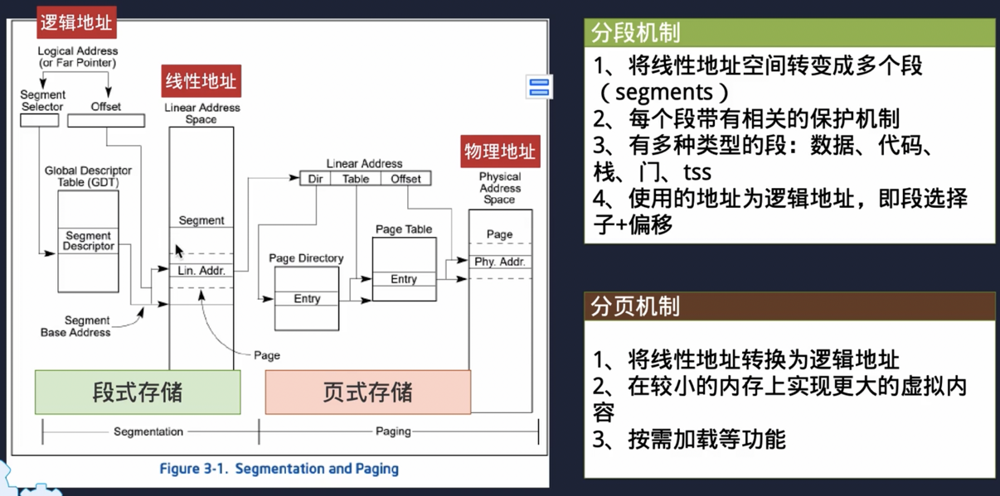
## 段选择子

索引从3开始存储，低 3 位有其他用途
## 内存访问的过程
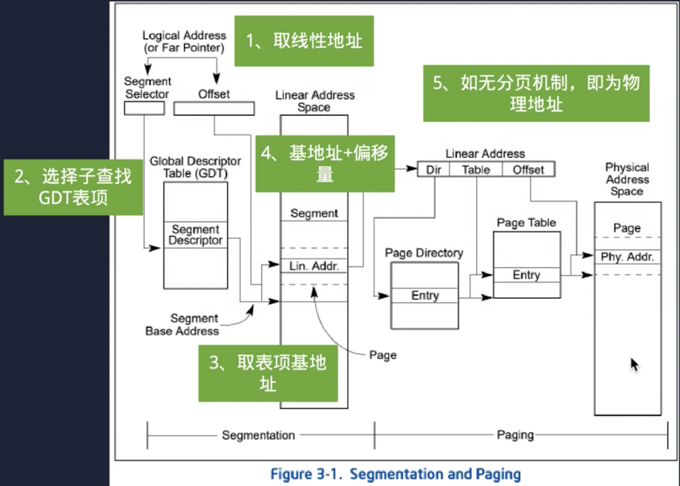
基地址+偏移地址=线性地址 
若是开启了分页，线性地址还需要再转换
## 中断处理
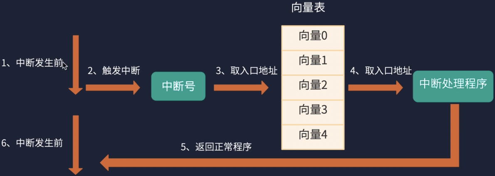
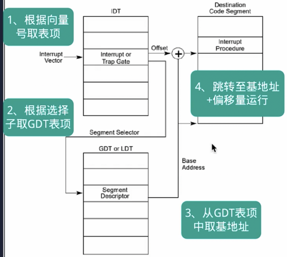
基地址在gdt表项中，偏移在idt表项中
## 中断保护
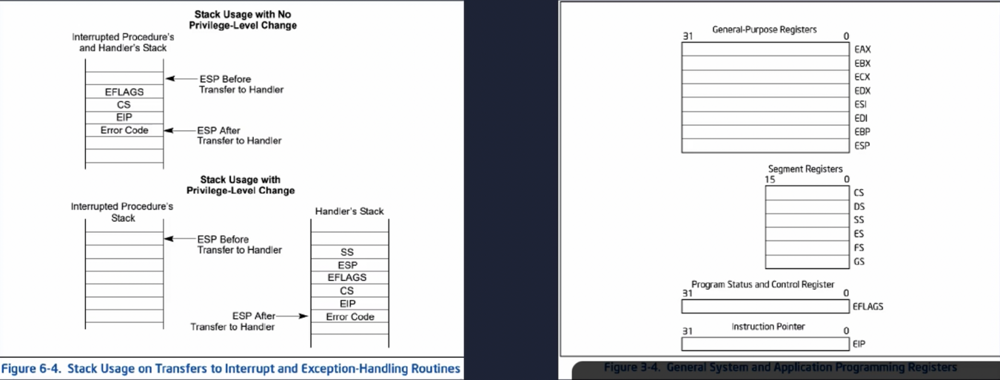
发生中断时cpu会自动压入栈中一些寄存器，还需要我们手动压入一些寄存器进行保护
## 中断处理参数传递

压入栈顶esp相当于上述参数结构体的指针(栈从高向低)
## TSS中各个字段
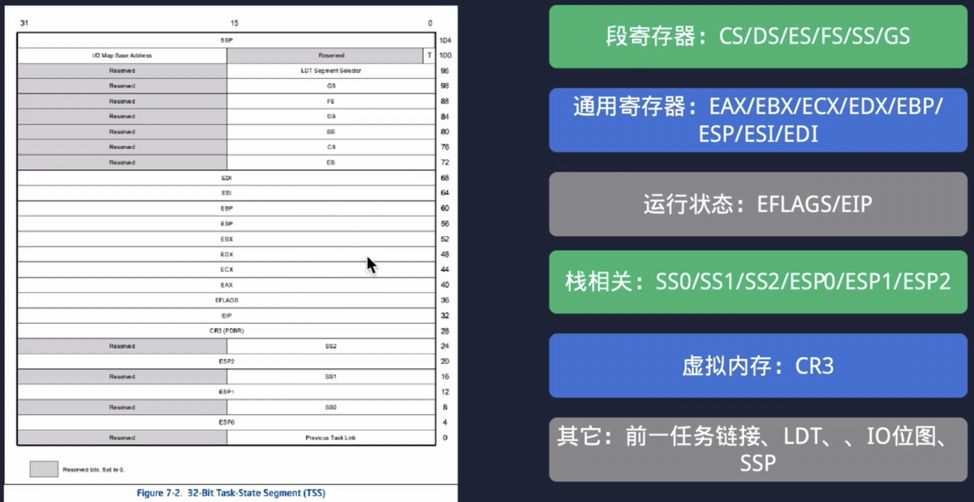
## 任务切换
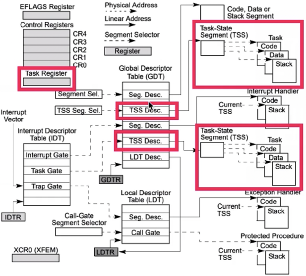
## 基本锁结构
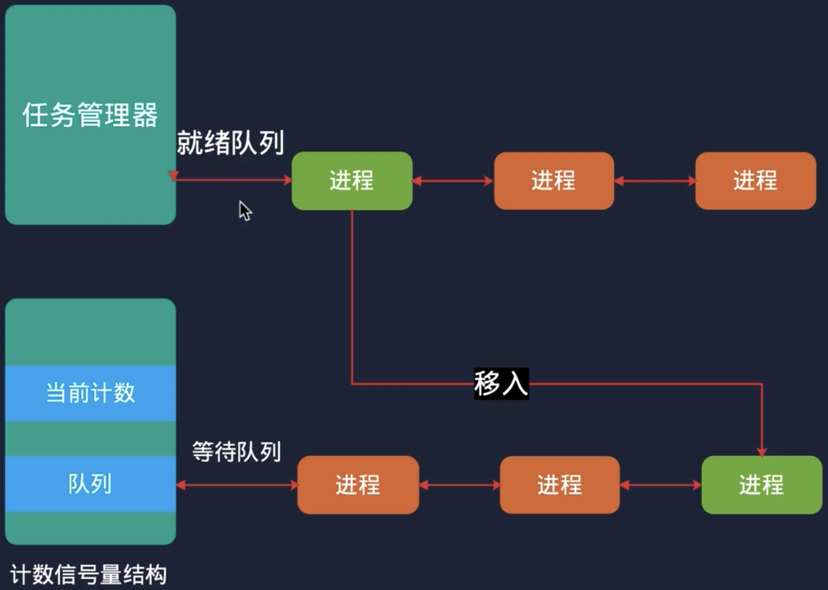
## 内存布局
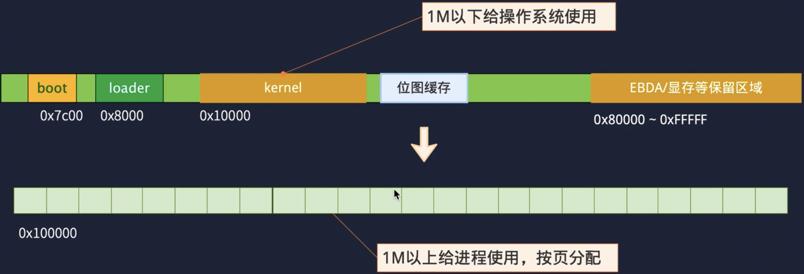
## 地址转换
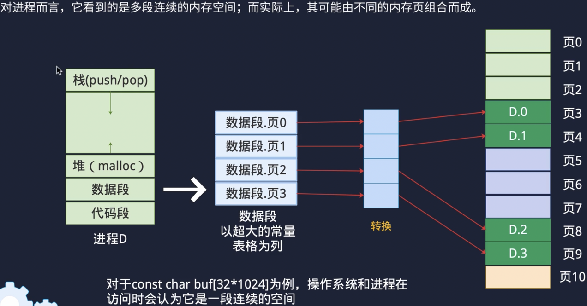
## 二级页表转换
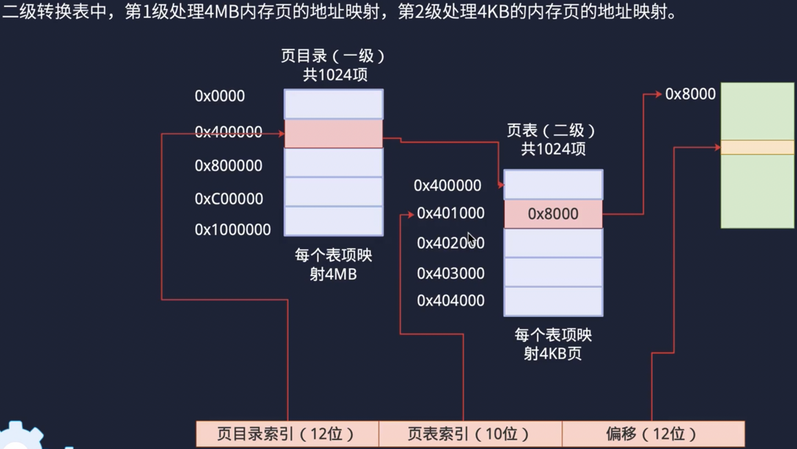
## 一级二级页表结构
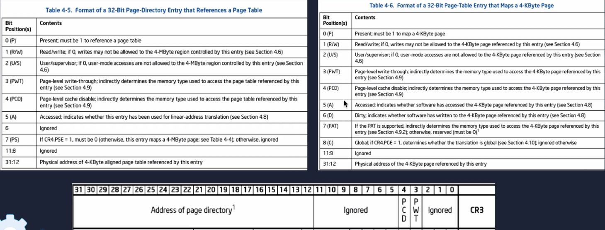
## 特权隔离
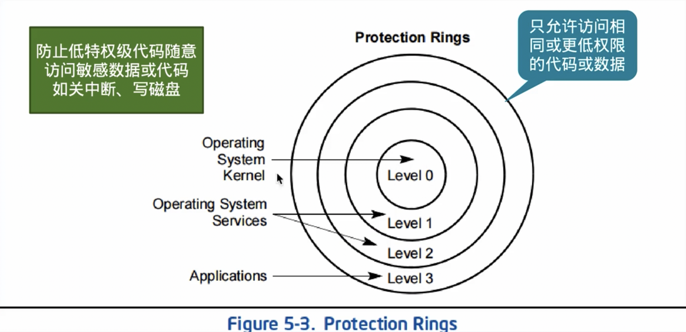
## 特权级别
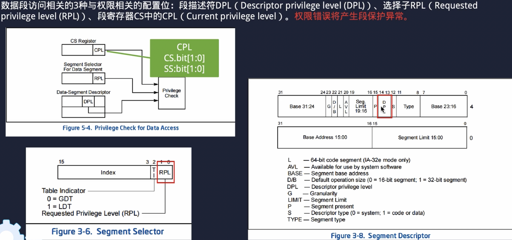

CPL：本身所处的特权级  
RPL：访问数据使用的特权级(位于段选择子) 
DPL：目标数据所需的特权级(位于段描述符)
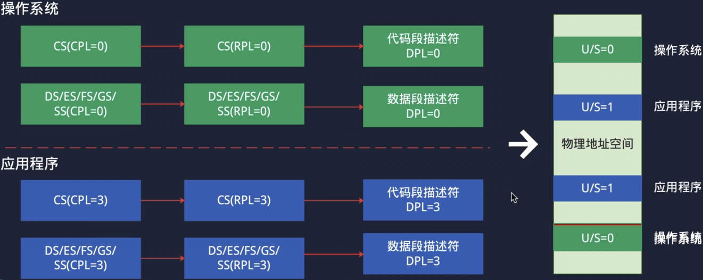
分页中系统内存只允许特权级 0 进行访问
## 调用门

存储在全局描述符表中，使用 lcalll 调用，类似创建进程 
除了使用调用门，还可以利用中断达到特权级切换的目的 
若是返回指针必须是调用方先准备好内存，系统把信息写入对应内存
## 新进程参数传递
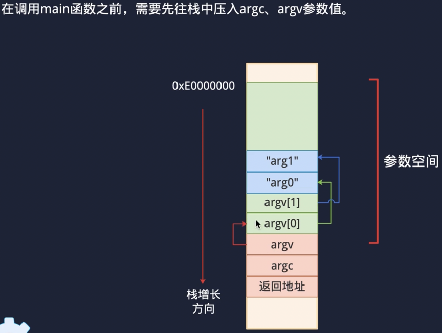
先设置返回地址(uint32)再设置参数，每次设置都要调整栈指针
## 文本模式
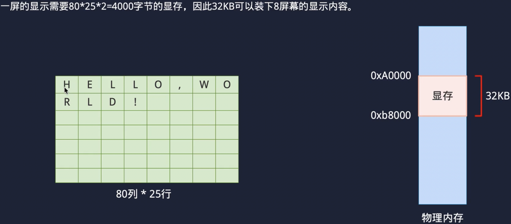
可以虚拟 8 个显示屏，每次只展示一个
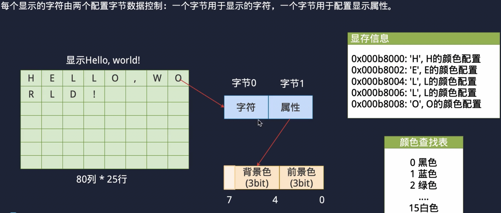
