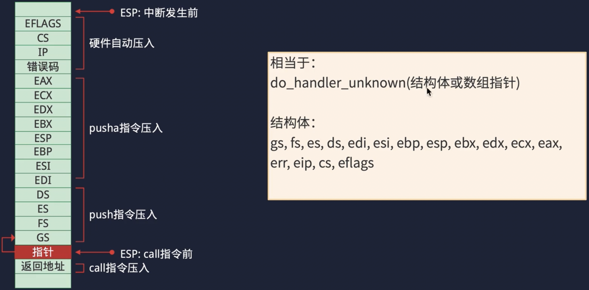

## 前置准备文档
https://www.yuque.com/lishutong-docs/lines200/bwqcvq
## 启动流程

8086的启动流程，但是为了兼容现代cpu 也是这样的
## 启动扇区

会依次检查所有磁盘的 0 扇区是否为引导扇区
## 开发流程

## 段:偏移的访问方式

因为CPU地址线只有20位，为了实现32位需要段寄存器，除此之外段寄存器还有其他作用
## 实模式内存映射

实模式下只能访问1m以内的内存，只有灰色区域可以自由使用(Boot程序与Boot栈区也在灰色区域)
## 实模式

## 保护模式

## 保护模式切换流程

## elf数据存储

## 内存分段分页

## 段选择子

索引从3开始存储，低 3 位有其他用途
## 内存访问的过程

基地址+偏移地址=线性地址 
若是开启了分页，线性地址还需要再转换
## 中断处理

基地址在gdt表项中，偏移在idt表项中
## 中断保护

发生中断时cpu会自动压入栈中一些寄存器，还需要我们手动压入一些寄存器进行保护
## 中断处理参数传递

压入栈顶esp相当于上述参数结构体的指针(栈从高向低)
## TSS中各个字段

## 任务切换

## 基本锁结构
