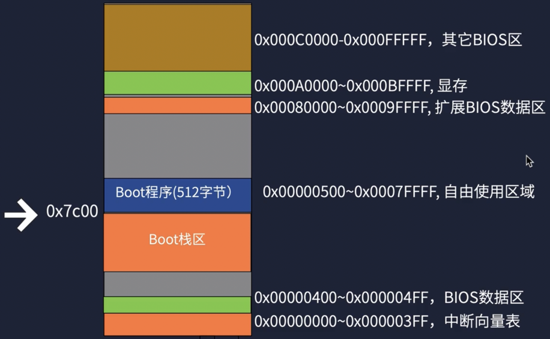

## 前置准备文档
https://www.yuque.com/lishutong-docs/lines200/bwqcvq
## 启动流程

8086的启动流程，但是为了兼容现代cpu 也是这样的
## 启动扇区

会依次检查所有磁盘的 0 扇区是否为引导扇区
## 开发流程

## 段:偏移的访问方式

因为CPU地址线只有20位，为了实现32位需要段寄存器，除此之外段寄存器还有其他作用
## 实模式内存映射

实模式下只能访问1m以内的内存，只有灰色区域可以自由使用(Boot程序与Boot栈区也在灰色区域)
